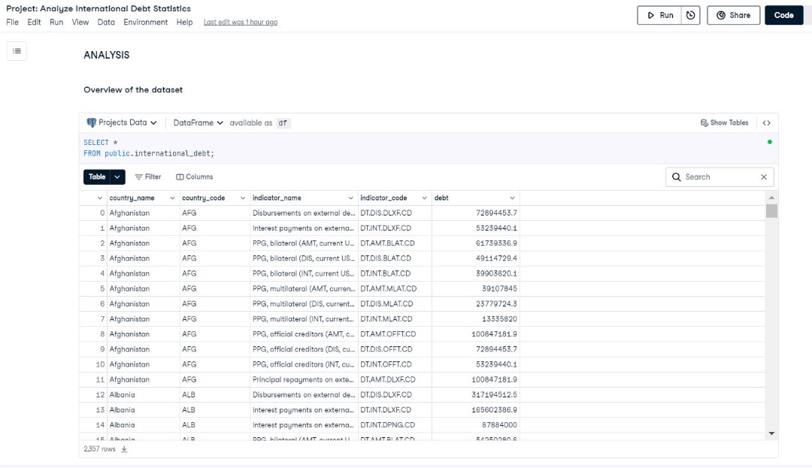
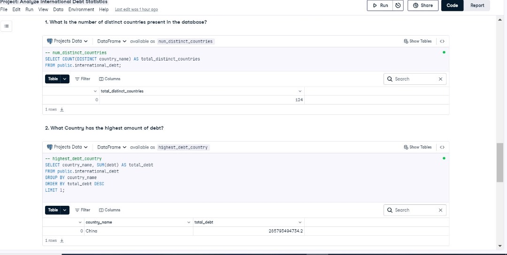
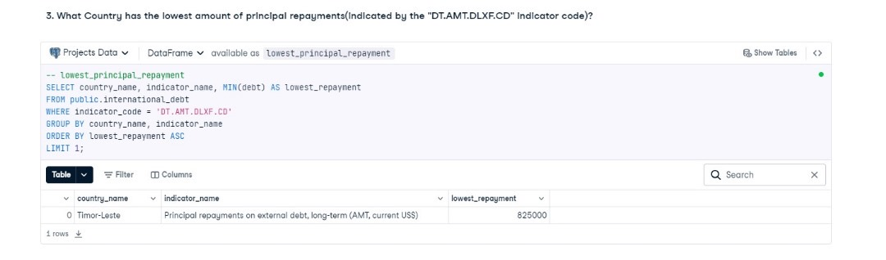

# ANALYSIS-OF-INTERNATIONAL-DEBT-STATISTICS-USING-SQL

Exploratory data analysis (EDA) of International debt statistics using SQL.
## INTRODUCTION

In today's interconnected world, managing national debt is a critical aspect of a country's economic strategy. Developing countries, in particular, often rely on external debt to fund essential projects and stimulate economic growth. The World Bank plays a pivotal role in this process by providing financial assistance to these nations. 

In this project, we will delve into a dataset provided by The World Bank, which contains detailed information about the debt owed by developing countries. Our goal is to perform an exploratory data analysis (EDA) to uncover insights and answer key questions about the debt landscape. Specifically, we will address the following questions:

1. What is the number of distinct countries present in the database?
2. Which country has the highest amount of debt?
3. Which country has the lowest amount of repayments?

By analyzing this data, we aim to gain a better understanding of the debt distribution among developing countries and identify significant patterns and trends. This analysis will provide valuable insights for policymakers, economists, and researchers interested in international debt dynamics.
## ANALYSIS
### Overview of the dataset

### 1. What is the number of distinct countries present in the database?
### 2. What Country has the highest amount of debt?

### 3. What Country has the lowest amount of principal repayments(indIcated by the  "DT.AMT.DLXF.CD" indicator code)?

## FINDINGS AND CONCLUSION
This analysis provides insights into the international debt landscape, focusing on key metrics such as the total number of distinct countries, the country with the highest amount of debt, and the country with the lowest amount of principal repayments.

### Total Number of Distinct Countries:

The dataset comprises 124 distinct countries, indicating a broad and diverse range of data points for international debt analysis.

### Country with the Highest Amount of Debt:
China stands out as the country with the highest amount of debt, totaling approximately 285.79 billion USD. This significant figure highlights China's substantial borrowing on the international stage.

### Country with the Lowest Amount of Principal Repayments:
Timor-Leste has the lowest amount of principal repayments, with a repayment amount of 825,000 USD. This could suggest a lower level of debt or a different debt management strategy compared to other countries.
Overall, the analysis underscores the varying debt levels and repayment strategies among different countries, providing a foundation for further exploration into the factors driving these differences.

## Project Notebook
You can view the complete project notebook on DataCamp Datalab by [Clicking here](https://www.datacamp.com/datalab/w/5840b2ea-2936-4e37-b1d1-f8f9a666578b/edit)

